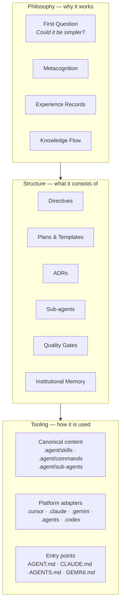
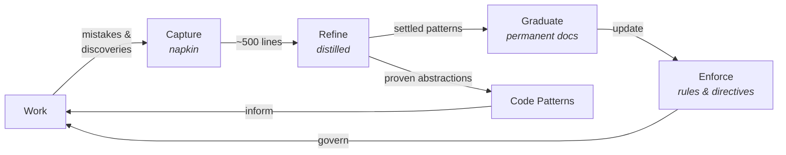
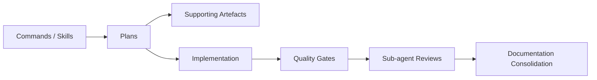

# The Practice

The Practice is the self-reinforcing system of principles, structures, agents, and tooling that
governs how work happens in this repository. It creates the conditions for safe, high-quality
human-AI collaboration. The Practice governs how work is done — it is not the product itself.

**See also**: For the Practice Core files and their roles, see [index.md](index.md). For navigable
links to this repo's directives, ADRs, and tools,
see [practice-index.md](../practice-index.md) — the bridge between the portable Core and the
local repo.

## Three Layers

The Practice operates in three layers. Each builds on the one below.

### Philosophy

The principles and learning mechanisms. The First Question ("could it be
simpler?"), metacognition (`.agent/directives/metacognition.md`), experience
records (`.agent/experience/`), and the knowledge flow. **Architectural
enforcement** is a core philosophical commitment: preferring physical
constraints (lint rules, boundary tooling) over human vigilance. **Strict and
complete, everywhere, all the time** is the operational expression of that
commitment: prefer fully enforced truth in the correct layer over permissive,
partial, or hand-wavy systems. This layer defines _why_ the Practice works.

### Structure

The organisational patterns. Directives (`.agent/directives/`), plans
(`.agent/plans/`), ADRs, sub-agent prompt architecture, quality gates, and
institutional memory (`.agent/memory/`). **Cross-agent standardisation**
(AGENTS.md, Agent Skills, MCP, A2A) is an evolving implementation direction to
keep the Practice portable and platform-agnostic. This layer defines _what_ the
Practice consists of.

### Tooling

Platform-specific implementations follow a canonical-first model: skills,
commands, rule policies, and any installed sub-agent templates all live in
`.agent/` (platform-agnostic). Thin platform adapters in `.cursor/`,
`.claude/`, `.gemini/`, `.github/`, `.agents/`, and `.codex/` reference
canonical content without duplicating it. In Codex, `.agents/skills/` carries
portable skills and command-shaped workflows only; `.codex/` carries
project-level metadata and, when installed, reviewer/domain-expert agent
configuration. Entry-point files (`AGENT.md`, `CLAUDE.md`, `AGENTS.md`,
`GEMINI.md`) direct each platform to the canonical Practice. Rules have two
layers: authoritative policies in `.agent/directives/principles.md` and
platform-specific activation triggers (for example Cursor `.cursor/rules/*.mdc`
or Claude Code `.claude/rules/*.md`). **Hook guardrails** follow the same canonical-first pattern:
policy in `.agent/hooks/`, shared runtime in `tools/`, thin native activation in platform config.
Hooks enforce session-start grounding, quality-gate reminders, and blocked shell patterns (e.g.
force-push, `--no-verify`). Keep the detailed supported and
unsupported platform mappings in a local surface matrix such as
`.agent/reference/cross-platform-agent-surface-matrix.md`; do not infer broad
parity from the existence of one portable adapter family. This layer defines
_how_ the Practice is used in a specific environment.

## The Knowledge Flow

The knowledge flow is the Practice's central mechanism. It converts raw experience into settled
knowledge through a progression of stages, each serving a broader audience and demanding a stricter
bar for entry.

### The Cycle

### Three Audiences

Each stage exists because it serves a different audience. The progression from capture to graduation
is a progression from narrow to broad.

| Stage        | Artefact                                | Audience                                | Fitness governor                                        |
| ------------ | --------------------------------------- | --------------------------------------- | ------------------------------------------------------- |
| **Capture**  | Napkin                                  | Current session                         | ~500 lines → distillation                               |
| **Refine**   | Distilled learnings                     | Future agents                           | ~200 lines → extraction to permanent docs               |
| **Graduate** | ADRs, governance docs, READMEs, TSDoc   | Everyone — humans and agents            | `fitness_line_count` frontmatter → split by responsibility |
| **Enforce**  | Rules, directives, always-applied rules | All agents, automatically               | `fitness_line_count` frontmatter on directives             |
| **Inform**   | Code patterns                           | Engineers facing a recognised situation | Barrier: broadly applicable, proven, recurring, stable. Practice-relevant patterns may travel via the exchange pack |

Not everything in the napkin survives distillation, and not everything distilled graduates to
permanent documentation. Each transition raises the bar. The `/jc-consolidate-docs` command drives
the graduation step — it checks which distilled entries have settled into permanent Practice
artefacts and moves them to their discoverable permanent home.

### Fitness Functions

Every stage has a governor that prevents unbounded growth. Without these, the knowledge flow
simply moves the accumulation problem downstream.

- **Napkin** → ~500 lines triggers distillation (see the distillation skill): extract high-signal
  patterns, archive the rest
- **Distilled** → target <200 lines; the primary reduction mechanism is extracting settled
  entries to permanent docs, not compression
- **Permanent docs** → each carries three fitness ceilings (`fitness_line_count`,
  `fitness_char_count`, `fitness_line_length`) and a `split_strategy`; exceeding any ceiling
  triggers splitting by responsibility or tightening
- **Practice Core** → the trinity files carry the same three-dimension ceilings.
  See [practice-lineage.md §Fitness Functions](practice-lineage.md#fitness-functions).

### Feedback Properties

The knowledge flow is stabilised by interlocking feedback. Quality gates, review
agents (where installed), and the learning loop detect entropy and convert it into corrective
knowledge (negative feedback). Agents improve agents, the self-teaching property improves
documentation, and consolidation extracts common threads into simpler structures (positive
feedback). These operate at different timescales — gates within seconds, learning within
sessions, consolidation across sessions — but all keep the Practice aligned with reality.

### The Transmission Dimension

The knowledge flow is itself part of the Practice, and the Practice travels via
[plasmid exchange](#plasmid-exchange). The knowledge flow pattern is therefore self-replicating:
a receiving repo inherits not just current rules but the mechanism that produced them. Each
repo's learning loop runs locally, producing learnings shaped by local context. When the Practice
returns to its origin via the Practice Box, it may carry patterns that the origin's own loop
hadn't surfaced — different work, different mistakes, different discoveries.

### Artefact Locations

- **Napkin** — `.agent/memory/napkin.md` — written continuously during every session
- **Distilled** — `.agent/memory/distilled.md` — curated rulebook, read at session start
- **Code patterns** — `.agent/memory/code-patterns/` — abstract proven patterns
- **Rules** — `.agent/directives/principles.md` (authoritative policies) + platform trigger
  adapters (e.g. `.cursor/rules/*.mdc`, `.claude/rules/*.md`)
- **Experience** — `.agent/experience/` — qualitative records of shifts in understanding

## The Review System

Specialist sub-agents provide targeted review after non-trivial changes. When a
repo has installed its reviewer layer, the `invoke-code-reviewers` rule
(canonically `.agent/rules/invoke-code-reviewers.md`) is the authoritative
source for the roster, invocation matrix, timing tiers, and triage checklist.
The local `AGENT.md` should either list the installed reviewer/domain-expert
roles or explicitly say that the agent layer is not yet installed. In Codex,
reviewer roles should be registered through project-agent support in `.codex/`
rather than modelled as skills.

Sub-agent prompts, when installed, follow a three-layer composition architecture: components,
templates, and wrappers.

## The Workflow

Work flows through a predictable sequence: commands and skills structure
the work, plans provide the execution detail, and quality gates validate
the output.

- **Commands** (`.agent/commands/`, with platform adapters in
  `.cursor/commands/`, `.claude/commands/`, `.gemini/commands/`, `.agents/skills/jc-*/`) — slash
  commands that initiate structured workflows
- **Skills** (`.agent/skills/`) — canonical skill definitions providing session workflows
  (start-right-quick, start-right-thorough, go) and passive capabilities (napkin,
  distillation, code-patterns, etc.). Platform adapters in `.cursor/skills/`,
  `.agents/skills/`, etc. are thin wrappers pointing to the canonical skills
  - **Plans** (`.agent/plans/`) — executable work plans forming a nested hierarchy from
    strategic overview down to hands-on implementation tasks:
  1. **Strategic index** — `high-level-plan.md` cross-collection overview
  2. **Collection roadmaps** — e.g. `semantic-search/roadmap.md` milestone sequence
  3. **Active execution plans** — e.g. `semantic-search/active/<plan-name>.md` with YAML
     frontmatter, phased execution, and deterministic validation. Mature repos keep one primary
     active plan in `active/`; completed plans usually stage in `current/complete/` before archive
  4. **Paused or parked workstreams** — mature repos may use `current/paused/` for incomplete
     but non-primary work that is expected to resume. A repo may also temporarily keep
     non-primary plans physically in `active/` when explicitly directed, but they must be
     labelled as parked-in-place context rather than companions
  5. **Platform-specific plans** — e.g. `.cursor/plans/*.plan.md` (Cursor plans) supplement
     the lowest-level active plans with session-scoped implementation tasks, batch breakdowns,
     and review checkpoints. These are created per-session and track fine-grained progress
     that is too ephemeral for the active plan itself
  6. **Value traceability** — every non-trivial plan states the outcome sought, the impact it
     should create, and the mechanism by which that impact creates value; otherwise the work is
     still under-framed
  7. **Documentation propagation** — before phase closure, propagate settled outcomes from
     plans into permanent docs: relevant ADRs, `.agent/practice-core/practice.md`, and any
     additionally impacted docs/READMEs. Apply the consolidate-docs command
- **Quality gates** — see `.agent/directives/principles.md` and the local quality-gate commands.
  All gates are always blocking.

## Artefact Map

| Location                                                  | What lives there                                                                                                                                                |
| --------------------------------------------------------- | --------------------------------------------------------------------------------------------------------------------------------------------------------------- |
| `.agent/directives/`                                      | Principles, rules, and operational directives                                                                                                                   |
| `.agent/practice-core/`                                   | Practice Core files: plasmid trinity (`practice.md`, `practice-lineage.md`, `practice-bootstrap.md`), entry points (README, index), changelog, and Practice Box |
| `.agent/plans/`                                           | Work planning — active, paused, archived, research, and optional supporting templates                                                                         |
| `.agent/memory/`                                          | Institutional memory — napkin, distilled learnings, and code patterns                                                                                           |
| `.agent/experience/`                                      | Experiential records across sessions                                                                                                                            |
| `.agent/skills/`                                          | Canonical skills — session workflows and passive capabilities (platform-agnostic)                                                                               |
| `.agent/sub-agents/`                                      | Canonical reviewer / domain-expert prompt architecture (optional until installed)                                                                               |
| `.agent/commands/`                                        | Canonical commands (platform-agnostic)                                                                                                                          |
| `.agent/research/`                                        | Research documents and analysis                                                                                                                                 |
| `.agent/reference/` (or equivalent)                       | Supporting reference material                                                                                                                                   |
| `.cursor/`, `.claude/`, `.gemini/`, `.github/`, `.agents/`, `.codex/` | Platform adapters: thin wrappers and project config referencing canonical content                                                                   |
| Repo's ADR directory                                      | Permanent architectural decision records (path varies by repo; see [practice-index](../practice-index.md))                                                    |

## Plasmid Exchange

The Practice is not confined to a single repo. The portable part of it travels as the Practice
Core: a package of seven files in `.agent/practice-core/` consisting of the plasmid trinity —
this file (the **what**), [practice-lineage.md](practice-lineage.md) (the **why**), and
[practice-bootstrap.md](practice-bootstrap.md) (the **how**) — the entry points
[README.md](README.md) (for humans) and [index.md](index.md) (for agents) — the changelog
([CHANGELOG.md](CHANGELOG.md)) — and the provenance file ([provenance.yml](provenance.yml)). The
trinity files evolve through real work; the entry points provide orientation; the changelog
records what changed; the provenance file tracks every repo that has shaped each trinity file.
Each repo carries its own Practice instance — there is no hierarchy.

The trinity files carry YAML frontmatter with a `provenance` pointer (to `provenance.yml`), and
three fitness ceilings: `fitness_line_count` (content lines), `fitness_char_count` (content
characters), and `fitness_line_length` (prose line width). All measure content only —
frontmatter is excluded. The provenance file always travels with the Core package.

The mechanism is documented in [practice-lineage.md](practice-lineage.md), which serves as both
the reference for how exchange works and the source template for outbound propagation. Optional
exchange context may travel separately in `.agent/practice-context/`, with sender-maintained
`outgoing/` material copied into receiver-side `incoming/` when needed. Proven code patterns may
also travel as part of the exchange pack — see
[practice-lineage.md §Code Pattern Exchange](practice-lineage.md#code-pattern-exchange).

### The Practice Box

`.agent/practice-core/incoming/` is the canonical location for incoming Practice Core files. It
is normally empty. When files arrive:

- **At session start** (via start-right), agents alert the user.
- **At consolidation** (via `/jc-consolidate-docs` step 8), agents perform the full integration
  flow: check the provenance chain, compare against the full local Practice system (not just
  `practice.md` — also rules, skills, commands, and directives), apply the three-part bar,
  propose specific changes, and clear the box after integration.

### Meta-Principles

Principles about the Practice itself — how it evolves, travels, and stays coherent — are maintained
as Learned Principles in
[practice-lineage.md §Learned Principles](practice-lineage.md#learned-principles). They include
self-containment, provenance chain design, separation of universal from domain-specific, and the
distinction between rules and skills.

## The Self-Teaching Property

The Practice is designed to be discoverable through use. `AGENT.md` links to
`principles.md`, which references `testing-strategy.md`. Commands and skills
structure the work, plans provide execution detail, and quality gates
validate the output. Where installed, sub-agents review work against the
same rules that guided its creation.
The napkin captures what went wrong, distillation extracts rules, and the rules
prevent repetition.

If you are new to this repository, start with `.agent/directives/AGENT.md`. Follow the links. The
Practice will teach itself.

## Sustainability and Scaling

The Practice spans ~1,000+ files. This volume is managed, not accidental — each layer generates
files with distinct lifecycles (directives are stable, plans are ephemeral, generated artefacts
are rebuilt on demand). Three mechanisms keep volume manageable: the knowledge flow's fitness
functions (§The Knowledge Flow above), the consolidate-docs command (which graduates plan content
to permanent docs then archives the plan), and sub-agent architecture consolidation (which
extracts common prompt patterns into shared templates).

Intentional repetition is a conscious balance choice: the Cardinal Rule appears in ~66 files so that
any contributor encounters it within their first few documents. DRY matters for code;
discoverability matters for onboarding. The risk is formulation drift, mitigated by the
consolidation command.

The Practice should be restructured if: consolidation cannot keep pace with file creation, the
distillation cycle takes longer than one session, semantic search for a core concept returns more
than 5 equally-weighted hits, or AI agents consistently exhaust context windows reading
overlapping content. The last two are leading mechanical indicators measurable before human
perception catches up.
